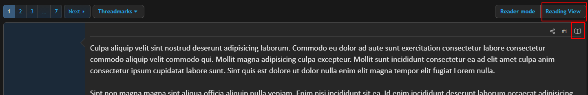
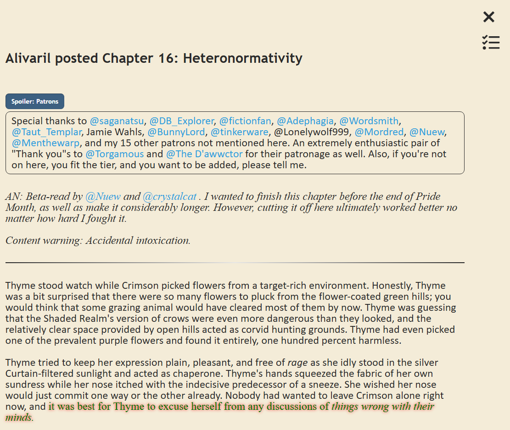
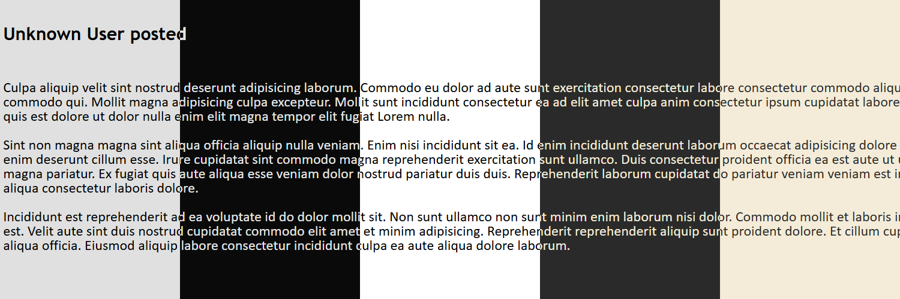
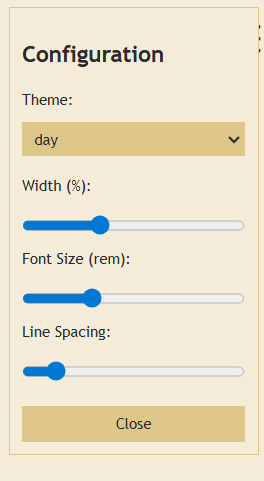
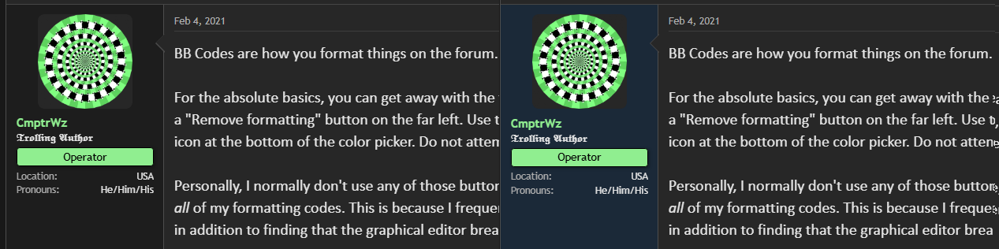

# Userscripts

## Sufficient Velocity Reading View

SV has a lot of fiction hosted on it. However, SV is a Xenforo forum, which is an excellent traditional forum but does not provide a very pleasant long-form text reading experience.

Browsers have reading modes but deal badly with SV's complex BB Code tags like Quotes, Code Blocks, Spoiler Blocks and more.

Additionally, browser reading modes intentionally strip down text formatting like fonts, colors and glows and "invisitext". This is normally good, but some writers are using features like that in meaningful ways.

This userscript tries to fill this gap by providing a Reading View for threads or posts that is both pleasant for reading long texts and friendly towards Sufficient Velocity's forum features.

## Opening Reading View

The Reading View button is available on threads with Threadmarks, much like the existing Reader Mode. Clicking it displays all the posts on the page in the Reading View.

The open book icon next to an individual post is always available and opens that single post in Reading View.

## Reading View

[Full Page Example](readme-assets/example-full.png)

## Themes and Options

Reading view has a few themes available:

- [Day](readme-assets/day.png)
- [Night](readme-assets/night.png)
- [Light](readme-assets/light.png)
- [Dark](readme-assets/dark.png)
- [Cool](readme-assets/cool.png)

And features options to control the size of the text, how much of the page it will use, and the space between lines.

## Caveats

This is a userscript that relies on the forum being laid out in certain ways and naming specific elements specific things. While Xenforo is a stable platform, it is entirely possible that updates may break the script. This script will update itself when new versions are available, but that still requires me to find out it broke and make time to fix it.

While most things display just fine, not all things remain functional. Things like quote blocks that need to be expanded and generally all elements that do something when you click on them can become unresponsive, especially in larger posts. This has to do with how Xenforo works. In theory I could try and fix those things, or reimplement them manually.

However, this userscript tries to remain as uninvasive as it can be. Trying to coerce the forum software to do what I want is only going to lead to me spending a lot of time to make SV a worse experience when you have this installed.

At this time, if you have a post you want to look at that features many elements that respond to clicking, there is a workaround. Opening the post in Reading View and then refreshing the page will put those elements into working order. This may or may not continue working. If this fails, you'll just have to read it the normal way.

### Installation Link

[SV Reading View](https://github.com/Stefan-v-Oudenaarden/Userscripts/raw/refs/heads/main/Sufficient%20Velocity/SV%20Readermode/sv-readingview.user.js)

## Sufficient Velocity OP Highlighter

A very simple script that highlights posts in a thread by the thread starter or original poster.

As you can see in the right example, the user information section of a post gets a blue background indicating that this is the person who started the thread.

### Installation Link

[OP Highlighter](https://github.com/Stefan-v-Oudenaarden/Userscripts/raw/refs/heads/main/Sufficient%20Velocity/SV%20OP%20Highlighting/sv-op-highlighting.user.js)

# Installing User Scripts

Choose one of these popular userscript managers for your browser:

### Violentmonkey (Recommended)

- **Firefox**: [Firefox Add-ons](https://addons.mozilla.org/en-US/firefox/addon/violentmonkey/)
- **Edge**: [Edge Add-ons](https://microsoftedge.microsoft.com/addons/detail/violentmonkey/eeagobfjdenkkddmbclomhiblgggliao)
- **Safari**: [App Store](https://apps.apple.com/us/app/violentmonkey-for-safari/id1552168677)

### Tampermonkey

- **Chrome/Edge**: [Chrome Web Store](https://chrome.google.com/webstore/detail/tampermonkey/dhdgffkkebhmkfjojejmpbldmpobfkfo)
- **Firefox**: [Firefox Add-ons](https://addons.mozilla.org/en-US/firefox/addon/tampermonkey/)
- **Safari**: [App Store](https://apps.apple.com/us/app/tampermonkey/id1482490089)
- **Opera**: [Opera Add-ons](https://addons.opera.com/en/extensions/details/tampermonkey-beta/)

After installing and familiarizing yourself with one of them, you can install one of these userscripts by clicking on one of the Installation Link URLs.
